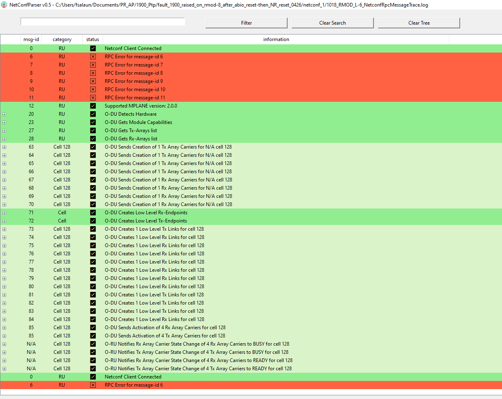

# NetConfParser
NetConfParser is a graphic tool displaying NETConf exchanges between a Netconf Server and a NetConf Client

It is also able to provide a quick analysis if the logs are coming from O-RAn Fronthaul protocol

## Log Format Support
The input for NetConfParser is a log file containing all messages exchanged.
NetConfParser handles multiple types of Log File:

  
plain xml

  

  

  
netopeer2-server format

  

  

## Parsing log file
NetConfParser supports drag and drop.
  

If the log file is heavy (multiple MBs), a progress bar appears on the right side.

Some RPC Replies may be very heavy and result in NetConfParser taking several seconds to display the whole data.
If you want to speed up the performance, you can uncheck the box `Parse Enormous RPCs` (default behaviour)

## Messages Display
### Main Window
After parsing your log file, the different exchanges will appear in the main frame.
Messages are displayed in the following categories:
- hello 
- rpc get-schema
- rpc get
- rpc
- rpc-reply
- notification netconf-config-change
- notification

A small summary of the contents of the message is available in the `data` cell. 

When a rpc is not answered, it is displayed in orange.
If the rpc-reply contains an rpc-error, it is displayed in red.

Full contents of each message can be displayed by clicking on the `+` sign:

### Searching for elements
You can use the `search` Text Box to display only elements of the tree that contain certain keywords.
Then click on `Filter` button to display
Only syntax supported is exact syntax (maybe regex will come)
To clear your search and go back to the full tree, click on `Clear Search` button
`Clear Tree` will clear the whole window.

### Copy Messages
Upon selecting a message, a formatted version of this message is displayed in the box on the right side:

You can then use the button `Copy To Clipboard` to copy it.

## ORAN Analysis
By clicking on the right button `See ORAN Analysis`, the view switches from message display to 
steps for Radio Configuration.

Steps supported:
- Netconf Client Connection
- Supported O-RAN MPlane version display
- Hardware Detection
- Module Capabilities 
- User Plane Configuration
- Creation/Deletion of Low Level Endpoints
- Creation of Low Level Links
- Creation/Activation/Deactivation/Deletion of Array Carriers
- Reporting of State BUSY/READY of Array Carriers

Also Failures are displayed
- Rpc Errors

In each of the steps a small summary of objects can be displayed by clicking on the `+` sign:

## Availability for Windows
NetConfparser zipfile is available in the [Releases tab](https://github.com/AeroFlorian/netconf-parser/releases)
Unzip it and launch NetConfParser.exe

## Building NetConfParser locally
NetConfParser can be built for Windows with pyinstaller
*  pyinstaller --windowed --icon=fs.ico -F netconfparser.py --add-data "fs_ico_encoded;." --additional-hooks-dir=.

* It will give an exe as output in dist folder
Please zip it if you want to distribute it
For Linux, you can use python netconfparser.py directly

